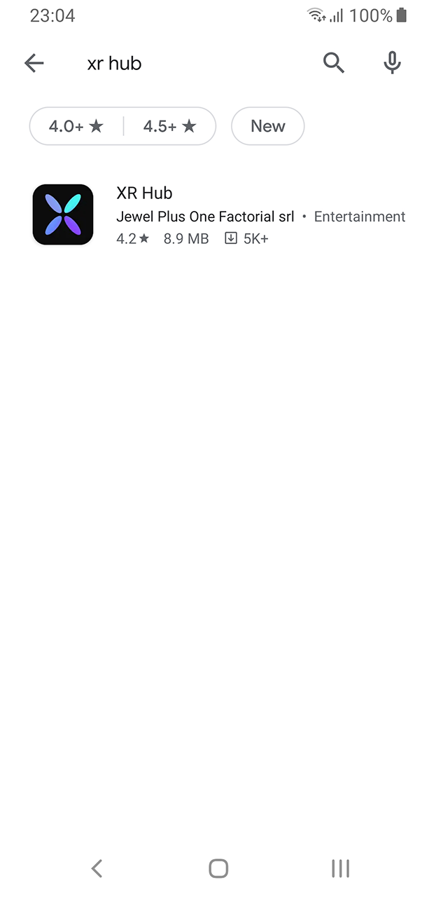
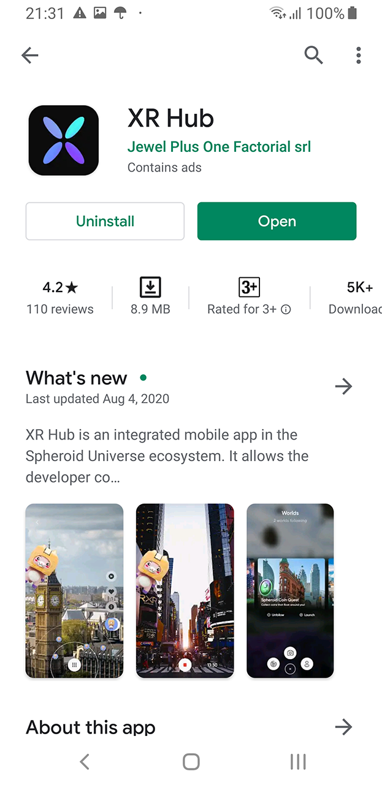
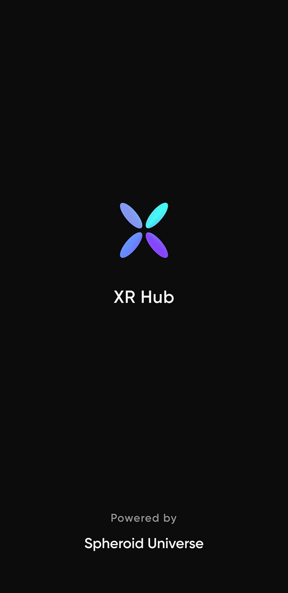
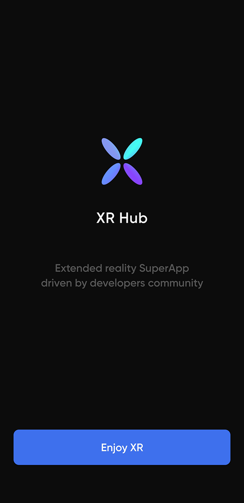
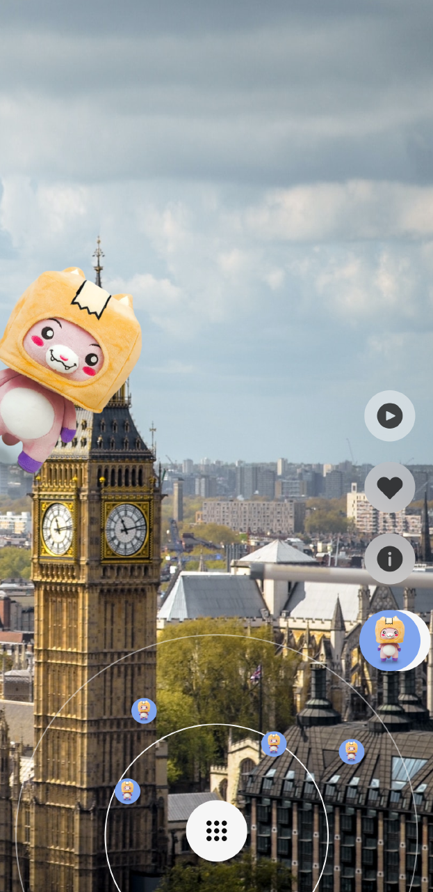

XR Flappy is a re-engineered fork of the SpheroidUnityExporter, originally developed by Spheroid Universe. This version builds upon the Exporter as a foundation for the enhanced XR Flappy experience.

The game transitions from a traditional 2D scrolling screen to a fully immersive AR experience, seamlessly integrating the gameplay into the player's real-world environment. This innovative style of augmented reality gameplay marks a significant evolution in spatial gaming.

XR Flappy is procedurally generated and powered by the latest version of Demiurge, highlighting the powerful capabilities of Spheroid Script and the Spheroid IDE. This project not only showcases the potential of Demiurge but also opens up exciting new possibilities for developers working within the Spheroid ecosystem.

## Create an account in the Spheroid Universe Platform

Before you create your app, you need to 
[create an account](https://spheroiduniverse.io/marketplace/register) in the Spheroid Universe Platform.

If you already have an account in the Spheroid Universe Platform, you can skip this step.


## Log in to the Spheroid Demiurge IDE

Now you have the access to all Platform services, including the Spheroid Demiurge IDE. 

Log in to the [Spheroid Demiurge IDE](https://demiurge.spheroiduniverse.io/ide), 
using the same email and password you used to register in the Platform.

## Create your app

Open the "Apps" tab and click the "Create" button. 


Enter the app name, leave the check on the "Create a layer corresponding to this app" box 
and click the "Create App" button. The app will be created along with the layer you will later 
use to publish the app into.


If the app doesn't get immediately created, and you get the error 
"Can't create an app because the app with the name 'xxx' already exists", 
it means the name you've chosen is already taken, so try another one.


## Download the source code

You need to create a demo app. 
Download a zip archive from the forked Repo [Flappy repo](https://github.com/sim248/SpheroidUnityExporter).

Then extract contents of the zip archive. You're now all set to upload the source code to your app!

## Upload the source code to Spheroid Demiurge IDE

Now, what you need to do is to upload the extracted files with source code to the IDE 
keeping the tree structure unchanged. 
So in the root of your app you need to have a folder named "assets",
as well as the four files.

```
(XR Flappy)
    |--- assets
    |   |--- audio
    |       |--- Pickup_Coin4.ogg
    |--- backGround007v2.glb
    |--- bird007v10.glb
    |--- FlappyCoin.png
    |--- Ground007v1.glb
    |--- Pipe007v6.glb
|--- app.json
|--- Client.spheroid
|--- ClientLibrary.spheroid
|--- GetPipesAction.spheroid
\--- SceneLibrary.spheroid


Currently, you can't upload a whole zip or a folder to the IDE 
but you can upload multiple files at once by a single drag-n-drop.

Open the "IDE" tab and select your app in the dropdown list.

Create the "assets" folder: right-click the app name and select the "Create a folder" option, 
then, when the dialog comes up, enter "assets" and click "OK". 
In this way, create each folder in the tree structure. There will be several folders where we will
put models and sounds we would like to use in the scene.


For each folder, left-click the folder to expand it. The text "Drag-n-drop files here to upload" 
will appear on the right. Drag-n-drop the files from the corresponding folder 
on your local PC.

Then, left-click the root folder (with the same name as your app) to expand it 
and drag-n-drop "app.json" and "Client.spheroid" files.


Drag-n-drop "ClientLibrary.spheroid" and "SceneLibrary.spheroid" files

You're done!


Now you can proceed to publishing your app.

## Publish your app

Click the "Publish" button in the top menu and, when the dialog comes up, keep the default settings, 
and click the "Publish" button at the right bottom of the dialog.


If the publication has been successful, you will see two info messages in the "Build" tab in the bottom pane. 
Congratulations, you have published your app!


If you don't see two info messages, or you see error messages instead, 
check you've followed the previous steps accurately and, if so, 
[write us an issue](https://spheroiduniverse.github.io/SpheroidScript/submit-an-issue.html), 
and we will help you solve the problem.

## Launch your app on your mobile phone

Now as you have your app built and published, it's time to run it on your mobile phone.

Download the XR Hub Android mobile app either by 
[following the Google Play link](https://play.google.com/store/apps/details?id=io.spheroid.spheroidandroid) 
or by scanning the QR code:


|  |  |  |  |
| --- | --- | --- | --- |
|  |  |  |  |

Currently, XR Hub works on the Android devices that [support ARCore](https://developers.google.com/ar/discover/supported-devices) 
only. iOS version of the app will be released soon.

Launch the XR Hub app on your phone.

|  |  |  |  |
| --- | --- | --- | --- |
|  |  |  |  |

Tap the menu button in the bottom center, then tap the account icon and 
log in to the app using the same email and password you used to register in the Platform.

|  |  |  | 
| --- | --- | --- | --- |
|  |  |  |  |

When you're authorized, swipe right through the list of worlds to find the world your app 
has been published into (world is called "layer" in the Spheroid Demiurge IDE). 
Note that if you're not logged in, you won't see the world, 
because the worlds created by developers are private. 
In the later tutorials you will learn how to add testers to your layer aka world.

|  |  |  |  |
| --- | --- | --- | --- |
|  |  |  |  |

When you've found your world, tap the "Launch" button, and your app will run.
Congratulations, you have successfully run your app in the XR Hub! 

Now you can try out some changes to the scene, export it and see for yourself how the changes apply.
For example, you can add the "island" model to the scene (you can find it in the "assets" folder).

## Troubleshooting

If you have encountered any problems, please let us know by 
[submitting an issue](https://spheroiduniverse.github.io/SpheroidScript/submit-an-issue.html), 
we will make sure to help you find the solution. Please don't hesitate to contact us, 
as your issues and our replies will help to make our platform better and will be valuable 
to other developers.

## What's next?

- [Spheroid Script Documentation](https://spheroiduniverse.github.io/SpheroidScript/)
- [Got a question? Submit an issue on GitHub](https://spheroiduniverse.github.io/SpheroidScript/submit-an-issue.html)


